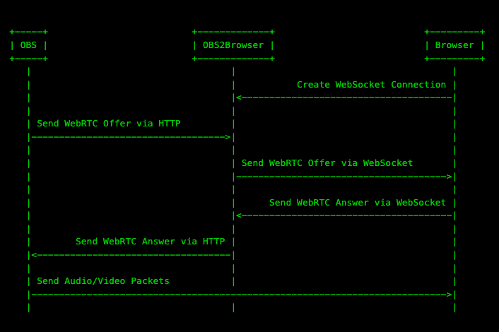
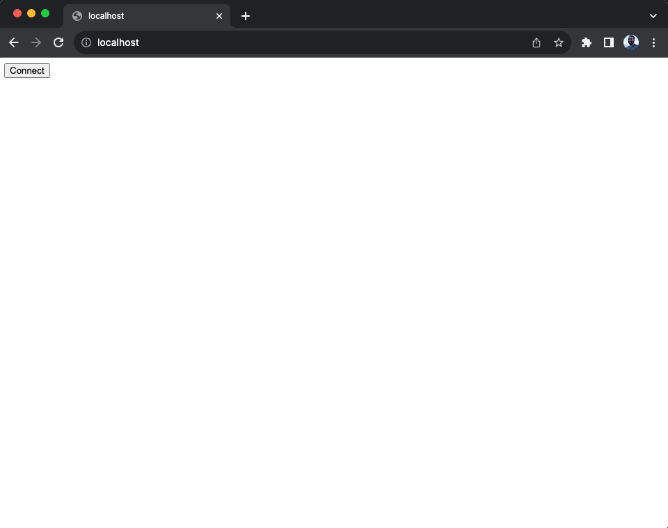
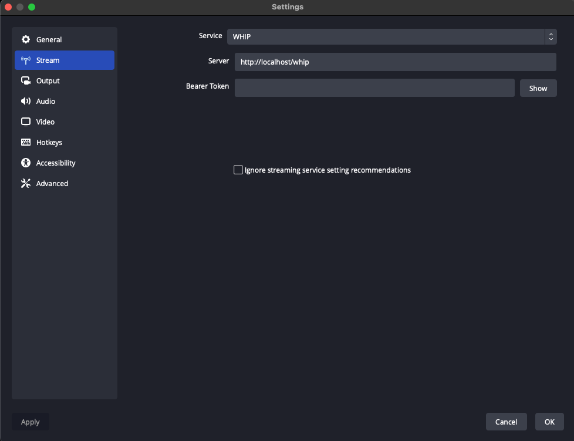
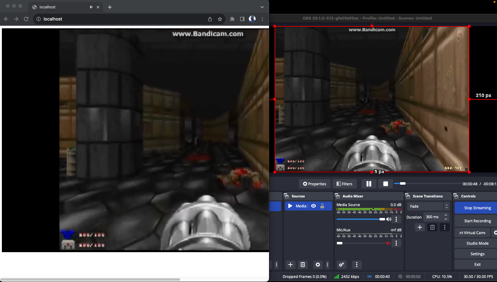

# OBS2Browser

OBS2Browser allows you to connect OBS directly to your web browser. Your audio/video goes
directly into your browser via P2P. This will reduce your stream delay and save on bandwidth costs!

On a properly configured local machine you can expect to see sub-100ms times.

## How it works

`OBS2Browser` is used to facilitate the handshake between your browser and OBS. It exists just to transport these messages.
After this handshaking is done `OBS2Browser` is never used. All of the media is exchanged directly between OBS and your browser.



To confirm this you can shut down `OBS2Browser` after the session has started. Your browser will continue to play frames from OBS even
though you are disconnected.

## How to use

### Run `OBS2Browser`

Execute `go run github.com/sean-der/OBS2Browser@latest` by default it listens on port 80. You can change that by setting the enviroment variable `HTTP_ADDR`.

You should see a log line for the HTTP Server starting

```
2023/08/15 14:51:24 Starting HTTP Server on :80
```

### Open in your browser

Open [http://localhost](http://localhost) and press the `Connect` button.



You will see a log in `OBS2Browser` that says the WebSocket has connected

```
2023/08/15 14:52:00 WebSocket connected
```

### Broadcast from OBS

Next configure OBS to the following

* **Service** - WHIP
* **Server** - http://localhost/whip
* **Bearer Token** - (None)




### Enjoy!

Press `Start Streaming`


